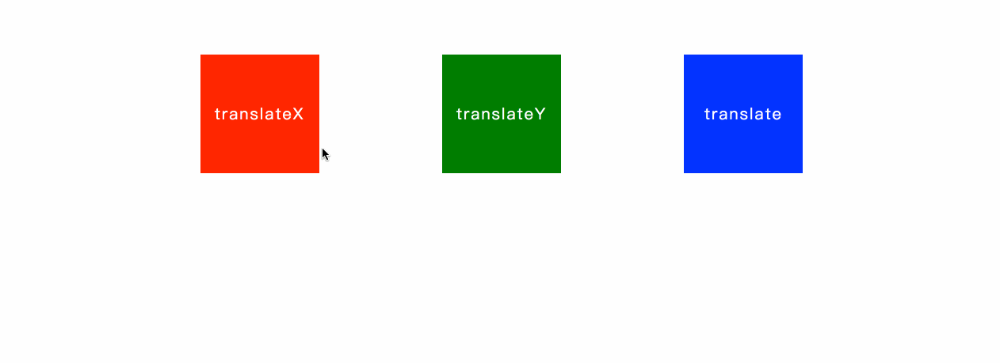

# 一、概述

  在CSS中执行变形转换的属性是CSS3属性中的 `transform`，能够执行“位移”、“旋转”、“缩放”、“倾斜”、“翻转”和“透视”等变形转换的设置，可以让Web页面的表现更加的“活跃”，增加页面的交互感，给用户留下更深的“印象”。但在用该属性进行设置时，特别是用于生产环境中时，一定要控制一个“度”，也就是说要避免“过度设计”，否则反而会让“印象”这一词有了贬义的意思。

# 二、transform

## 1、translate

  该属性值可以让元素从当前位置根据“ `left`（X轴）”参数和“ `top`（Y轴）”参数的设置在水平和垂直方向进行移动。它和用于布局的“ `position` ”属性，特别是当它的“ `position` ”的值为“ `relative `”时十分相似，在进行移动后，自身的位置仍然保留，也不会影响到其它元素的位置，但有存在着区别：

- “translate”可以作用于已经执行了“绝对定位（position：absolute）”的元素，而要用“position”已经设置为了“绝对定位”的元素使用“相对定位（position：relative）”需要对布局进行重新计算，或修改DOM的标签嵌套方式。
- 使用“translate”可以让 GPU 参与运算，动画的 FPS 更高。
- 使用“translate”可以让动画的像素精确到浮点数，而使用“position”属性的值最小执行动画的单位是1像素。

  所以说，“position”属性是为布局而生，而“Transform”的“translate”是为动画而生。

  该属性值有三种类型：

- **translateX( x )**：设置元素在X轴方向的偏移
- **translateY( y )**：设置元素在Y轴方向的偏移
- **translate( x, y )**：同时设置元素在X轴和Y轴方向的偏移

```html
<div class="wrap">
    <section class="box red-box">translateX</section>
    <section class="box green-box">translateY</section>
    <section class="box blue-box">translate</section>
</div>
```

```css
.wrap {
    text-align: center;
}
.wrap > .box {
    width:  150px;
    height: 150px;
    margin: 75px;
    display: inline-block;

    cursor: pointer;

    text-align: center;
    line-height: 150px;
    letter-spacing: 2px;
    font-size: 20px;
    color: #fff;

    -webkit-transition: all .25s linear;
    -moz-transition: all .25s linear;
    -ms-transition: all .25s linear;
    -o-transition: all .25s linear;
    transition: all .25s linear;
}
.wrap > .red-box {
    background-color: red;
}
.wrap > .red-box:hover {
    -webkit-transform: translateX(150px);
    -moz-transform: translateX(150px);
    -ms-transform: translateX(150px);
    -o-transform: translateX(150px);
    transform: translateX(150px);
}

.wrap > .green-box {
    background-color: green;
}
.wrap > .green-box:hover {
    -webkit-transform: translateY(150px);
    -moz-transform: translateY(150px);
    -ms-transform: translateY(150px);
    -o-transform: translateY(150px);
    transform: translateY(150px);
}

.wrap > .blue-box {
    background-color: blue;
}
.wrap > .blue-box:hover {
    -webkit-transform: translate(-150px, 150px);
    -moz-transform: translate(-150px, 150px);
    -ms-transform: translate(-150px, 150px);
    -o-transform: translate(-150px, 150px);
    transform: translate(-150px, 150px);
}
```



## 2、rotate

  该属性值会让元素以当前元素的中心(X=width/2，Y=height/2)进行旋转（若不对“transform-origin”进行设置），旋转的角度为参数所设定的值，“正数”是顺时针，“负数”是逆时针，单位为“*deg*”。

  该属性有三种类型：

- **rotateX( angle )**：设置元素在X轴方向的旋转
- **rotateY( angle )**：设置元素在Y轴方向的旋转
- **rotateZ( angle )**：设置元素在Z轴方向的旋转

```html
<div class="wrap">
    <section class="box red-box">rotateX</section>
    <section class="box green-box">rotateY</section>
    <section class="box blue-box">rotateZ</section>
</div>
```

```css
.wrap {
    text-align: center;
}
.wrap > .box {
    width:  150px;
    height: 150px;
    margin: 75px;
    display: inline-block;

    cursor: pointer;

    text-align: center;
    line-height: 150px;
    letter-spacing: 2px;
    font-size: 20px;
    color: #fff;

    -webkit-transition: all 1s linear;
    -moz-transition: all 1s linear;
    -ms-transition: all 1s linear;
    -o-transition: all 1s linear;
    transition: all 1s linear;
}
.wrap > .red-box {
    background-color: red;
}
.wrap > .red-box:hover {
    -webkit-transform: rotateX(360deg);
    -moz-transform: rotateX(360deg);
    -ms-transform: rotateX(360deg);
    -o-transform: rotateX(360deg);
    transform: rotateX(360deg);
}

.wrap > .green-box {
    background-color: green;
}
.wrap > .green-box:hover {
    -webkit-transform: rotateY(360deg);
    -moz-transform: rotateY(360deg);
    -ms-transform: rotateY(360deg);
    -o-transform: rotateY(360deg);
    transform: rotateY(360deg);
}

.wrap > .blue-box {
    background-color: blue;
}
.wrap > .blue-box:hover {
    -webkit-transform: rotateZ(360deg);
    -moz-transform: rotateZ(360deg);
    -ms-transform: rotateZ(360deg);
    -o-transform: rotateZ(360deg);
    transform: rotateZ(360deg);
}
```


## 3、scale

  该属性值会让元素以当前元素的中心进行缩放，参数的值为一个整数或浮点数，如：“1（默认）”不进行缩放，“0.8”缩小为原来的80%，“1.5”扩大到原来的150%，参数不需要单位。

  该属性值有三种类型：

- **sclaeX ( x )**：设置元素在X轴方向的缩放
- **sclaeY ( y )**：设置元素在Y轴方向的缩放
- **sclae ( x, y )**：设置元素在X轴及Y轴方向的缩放

```html
<div class="wrap">
    <section class="box red-box">scaleX</section>
    <section class="box green-box">scaleY</section>
    <section class="box blue-box">scale</section>
</div>
```

```css
.wrap {
    text-align: center;
}
.wrap > .box {
    width:  150px;
    height: 150px;
    margin: 75px;
    display: inline-block;

    cursor: pointer;

    text-align: center;
    line-height: 150px;
    letter-spacing: 2px;
    font-size: 20px;
    color: #fff;

    -webkit-transition: all .25s linear;
    -moz-transition: all .25s linear;
    -ms-transition: all .25s linear;
    -o-transition: all .25s linear;
    transition: all .25s linear;
}
.wrap > .red-box {
    background-color: red;
}
.wrap > .red-box:hover {
    -webkit-transform: scaleX(.8);
    -moz-transform: scaleX(.8);
    -ms-transform: scaleX(.8);
    -o-transform: scaleX(.8);
    transform: scaleX(.8);
}

.wrap > .green-box {
    background-color: green;
}
.wrap > .green-box:hover {
    -webkit-transform: scaleY(2);
    -moz-transform: scaleY(2);
    -ms-transform: scaleY(2);
    -o-transform: scaleY(2);
    transform: scaleY(2);
}

.wrap > .blue-box {
    background-color: blue;
}
.wrap > .blue-box:hover {
    -webkit-transform: scale(1.1, 1.3);
    -moz-transform: scale(1.1, 1.3);
    -ms-transform: scale(1.1, 1.3);
    -o-transform: scale(1.1, 1.3);
    transform: scale(1.1, 1.3);
}
```


## 4、skew

  该属性值会让元素根据水平（X轴）和垂直（Y轴）线参数设定倾斜角度。该属性值有三种类型：

- **skewX( angle )**：设置元素在水平轴方向的倾斜
- **skewY( angle )**：设置元素在垂直轴方向的倾斜
- **skewX( x-angle, y-angle )**：设置元素在水平轴及垂直轴方向的倾斜

```html
<div class="wrap">
    <section class="box red-box">skewX</section>
    <section class="box green-box">skewY</section>
    <section class="box blue-box">skew</section>
</div>
```

```css
.wrap {
    text-align: center;
}
.wrap > .box {
    width:  150px;
    height: 150px;
    margin: 75px;
    display: inline-block;

    cursor: pointer;

    text-align: center;
    line-height: 150px;
    letter-spacing: 2px;
    font-size: 20px;
    color: #fff;

    -webkit-transition: all .25s linear;
    -moz-transition: all .25s linear;
    -ms-transition: all .25s linear;
    -o-transition: all .25s linear;
    transition: all .25s linear;
}
.wrap > .red-box {
    background-color: red;
}
.wrap > .red-box:hover {
    -webkit-transform: skewX(45deg);
    -moz-transform: skewX(45deg);
    -ms-transform: skewX(45deg);
    -o-transform: skewX(45deg);
    transform: skewX(45deg);
}

.wrap > .green-box {
    background-color: green;
}
.wrap > .green-box:hover {
    -webkit-transform: skewY(45deg);
    -moz-transform: skewY(45deg);
    -ms-transform: skewY(45deg);
    -o-transform: skewY(45deg);
    transform: skewY(45deg);
}

.wrap > .blue-box {
    background-color: blue;
}
.wrap > .blue-box:hover {
    -webkit-transform: skew(15deg, 20deg);
    -moz-transform: skew(15deg, 20deg);
    -ms-transform: skew(15deg, 20deg);
    -o-transform: skew(15deg, 20deg);
    transform: skew(15deg, 20deg);
}
```


## 5、transform 组合值

## 6、transform-origin

# 四、transform-3D

## 1、transform-style

## 2、perspective & perspective-origin

## 3、backface-visibility


